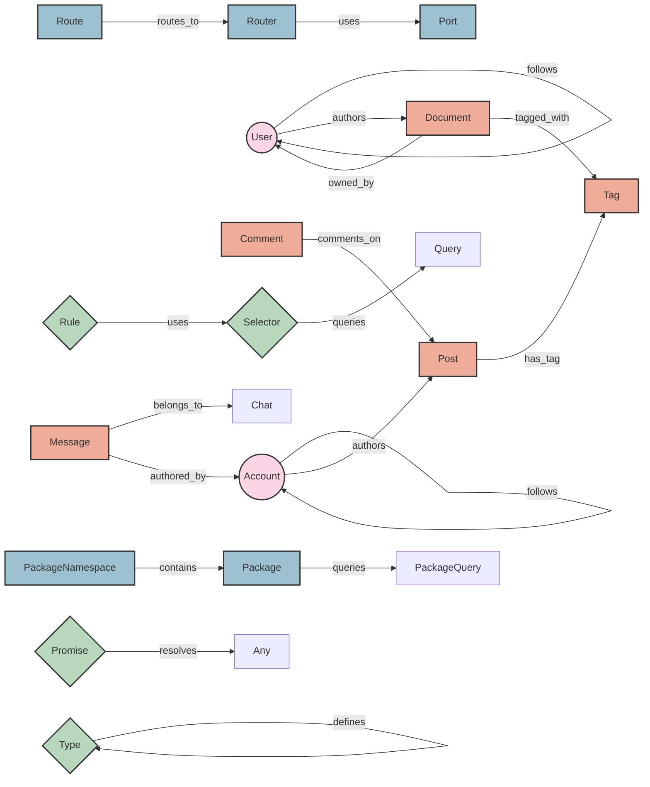

# Cyberlink Graph Structure Analysis

## Overview
This report provides a comprehensive analysis of the cyberlink graph structure, visualizing the relationships between different entities in the system. The graph is organized into four main domains: Social, Content, System, and Infrastructure.

## Graph Visualization

## Domain Analysis

### 1. Social Domain
- **Core Entities**: Account, User
- **Key Relationships**:
  - Account-to-Account following
  - User-to-User following
  - Content authorship
- **Purpose**: Manages social interactions and content ownership

### 2. Content Domain
- **Core Entities**: Post, Comment, Message, Document, Tag
- **Key Relationships**:
  - Comments on Posts
  - Messages in Chats
  - Document and Post tagging
- **Purpose**: Handles all content-related data and metadata

### 3. System Domain
- **Core Entities**: Type, Promise, Selector, Rule
- **Key Relationships**:
  - Type definitions
  - Rule-based selection
  - Promise resolution
- **Purpose**: Provides system-level functionality and type management

### 4. Infrastructure Domain
- **Core Entities**: Router, Port, Route, PackageNamespace, Package
- **Key Relationships**:
  - Routing configuration
  - Package management
  - Network infrastructure
- **Purpose**: Manages system infrastructure and networking

## Entity Relationships

### Direct Relationships
1. **Social Graph**
   - Account → Account (follows)
   - User → User (follows)
   - Account → Post (authors)
   - User → Document (authors)

2. **Content Organization**
   - Comment → Post (comments_on)
   - Message → Chat (belongs_to)
   - Document/Post → Tag (tagged_with)

3. **System Configuration**
   - Rule → Selector (uses)
   - Selector → Query (queries)
   - Type → Type (defines)

4. **Infrastructure Setup**
   - Route → Router (routes_to)
   - Router → Port (uses)
   - PackageNamespace → Package (contains)

### Cross-Domain Relationships
- Document → User (owned_by)
- Message → Account (authored_by)

## Visual Representation Guide

### Node Shapes
- **Circles (())**: Social entities (Account, User)
- **Rectangles []**: Content and Infrastructure entities
- **Diamonds {}**: System components

### Color Coding
- **Pink**: Social Domain
- **Orange**: Content Domain
- **Green**: System Domain
- **Blue**: Infrastructure Domain

## Implementation Notes

1. **Type System**
   - Hierarchical type definitions
   - Support for custom types
   - Type-safe relationships

2. **Content Management**
   - Hierarchical content structure
   - Tagging system
   - Ownership tracking

3. **Infrastructure**
   - Modular routing system
   - Package management
   - Query handling

4. **Social Features**
   - Bidirectional relationships
   - Content ownership
   - User interactions

## Recommendations

1. **Performance Optimization**
   - Implement caching for frequently accessed relationships
   - Optimize query patterns for common operations
   - Consider indexing heavily used relationship types

2. **Scalability**
   - Design for horizontal scaling of social relationships
   - Implement sharding for content storage
   - Consider caching strategies for system components

3. **Security**
   - Implement access control for cross-domain relationships
   - Validate relationship types at creation
   - Audit sensitive operations

4. **Maintainability**
   - Document relationship types
   - Implement monitoring for system health
   - Regular audit of unused relationships 